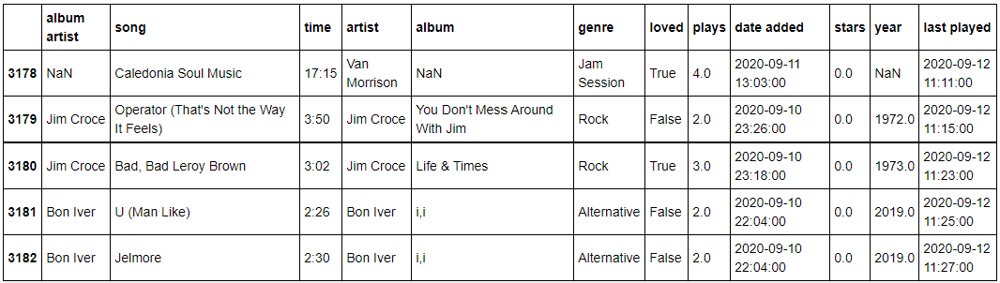
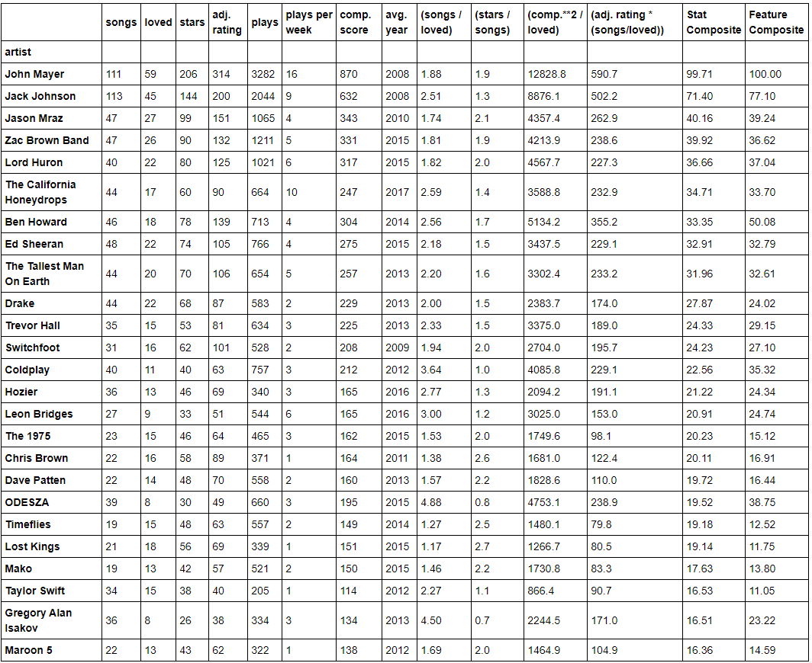
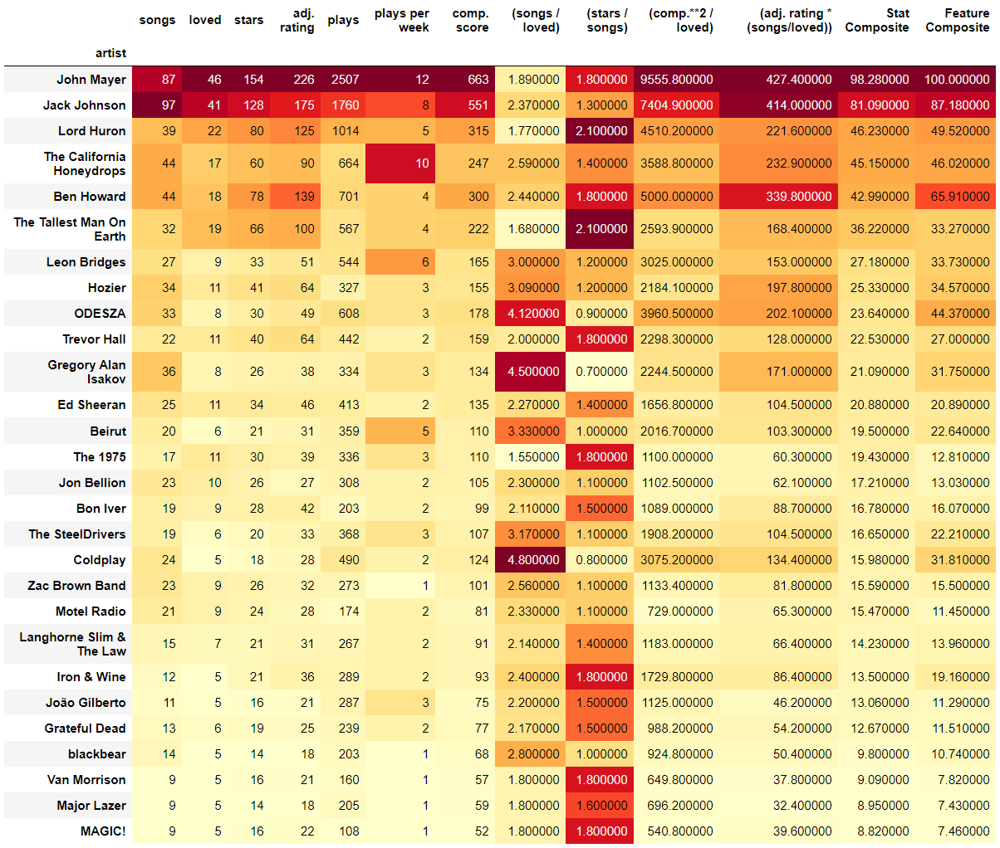
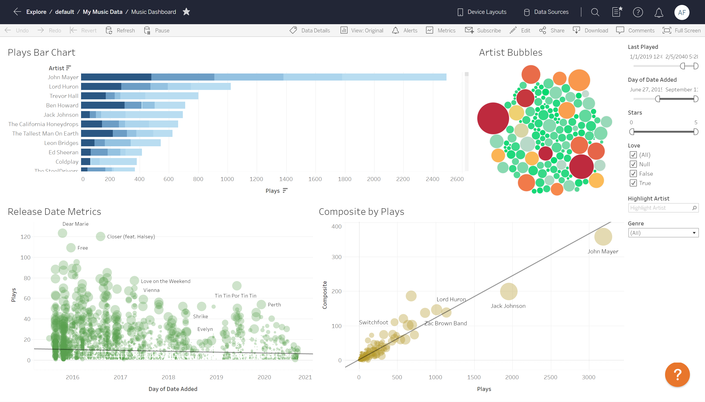

# Top Artists
An analysis run on my music library to discover quantitative measures for determining top artists given Apple Music library data
 

## Jupyter Notebook
In my jupyter notebook analysis using Python, I began with data taken directly from my itunes library, that included the following categories:

After that, I created a function to aggregate stats by artist using a pivot table. I extracted a variety of measurements from the initial 
DataFrame, created mechanisms by which I could filter out songs by when they were added to my library or when the last time I'd listened to 
them was, and then created a variety of features that I thought would be useful in quantifying which artists were really capturing my attention
and affection. 

To give a details about a few of the things I did here: 

The plays per week gave me issue when being used as a metric for how frequently I listened to an artist's songs, because the songs most recently 
added had much higher values, with the small number of weeks since the song was added in the denominator far outweighing the smaller number of plays in the numerator, 
since I listen to songs I've just added more frequently than old ones. This was making this statistic severely unbalanced towards artists with recently 
added songs, so I transformed the data to a more level distribution by adding 40 "empty" weeks to the calculation, then multiplying by a ratio of (6/5),
which brought songs added 200 weeks ago (a somewhat central point in my library) to the same value they had before the transformation, while decreasing
the value of songs added after that, and increasing the value of songs added before that.

Finally, I created a function to create a list of my top artists, using the most relevant filters and sorting the list. There are a lot of options to 
adjust ratings, and I experimented with many before deciding to go with the one below. This one sorts by "Stat Composite", which takes an equal weight to
each of the six first artist statistics and gives a score out of 100 based on how well the artist stacks up against the maximum in each field. I chose
this metric because it is robust and easier to see how artists earn their top places. Other metrics are more complex and in many cases capture strengths 
of artists that are not reflected in the "Stat Composite". The columns are color mapped to help reveal some of these artists:

One of the more nuanced filters I used was removing artists with less than a 1.5 (songs/loved) ratio. Although it seems counter-intuitive to remove artists that have a large percentage of their songs rated as "loved", the reasoning for this was because there were multiple artists who were showing up with high statistics because their 
only songs that made it past the filter of "listened since" (which filters out songs that I haven't listened to since a given date) were the few that 
they had with high ratings or that would be present in a lot of my playlists; gathering high statistics because of those songs that I listened to a lot 
when I was younger, but otherwise they might be artists I no longer listen to. 

## Tableau
Here is a dashboard I made in Tableau from my music data, giving the options to filter by songs last played within a certain time frame,
date the songs were added to my library, the number of stars I'd given the songs, whether or not they'd been "loved", and by genre.

